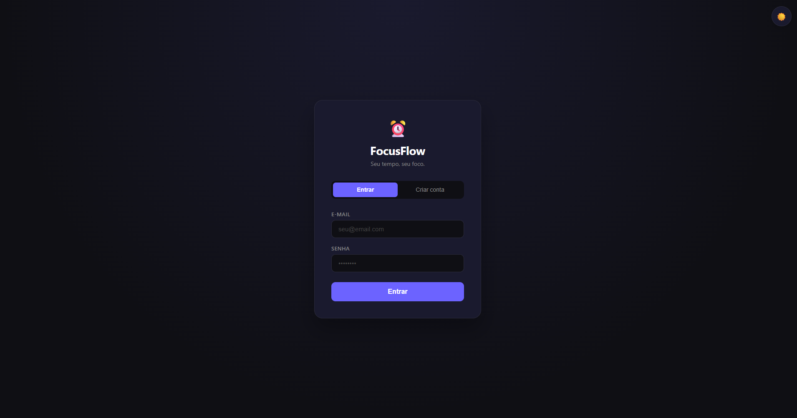
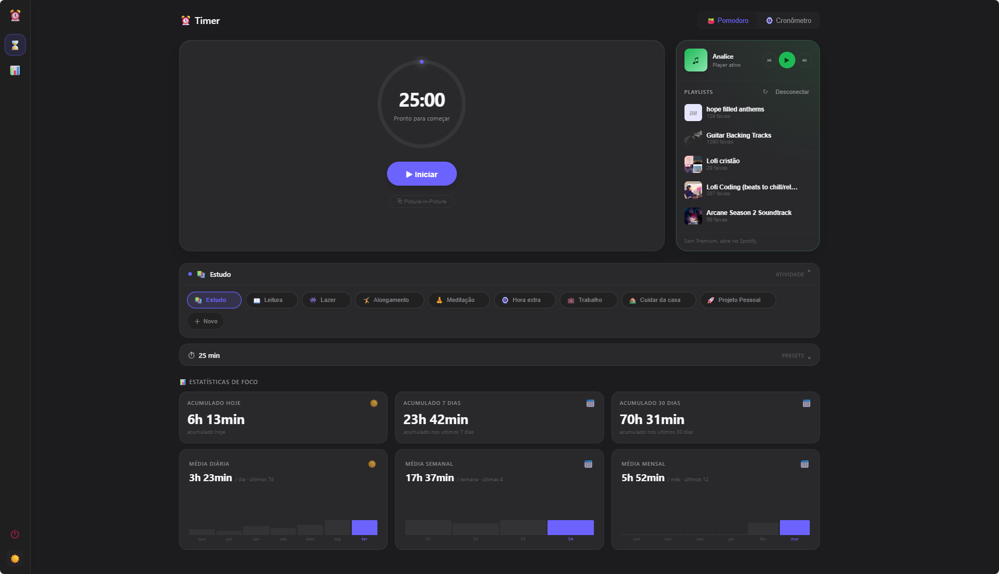
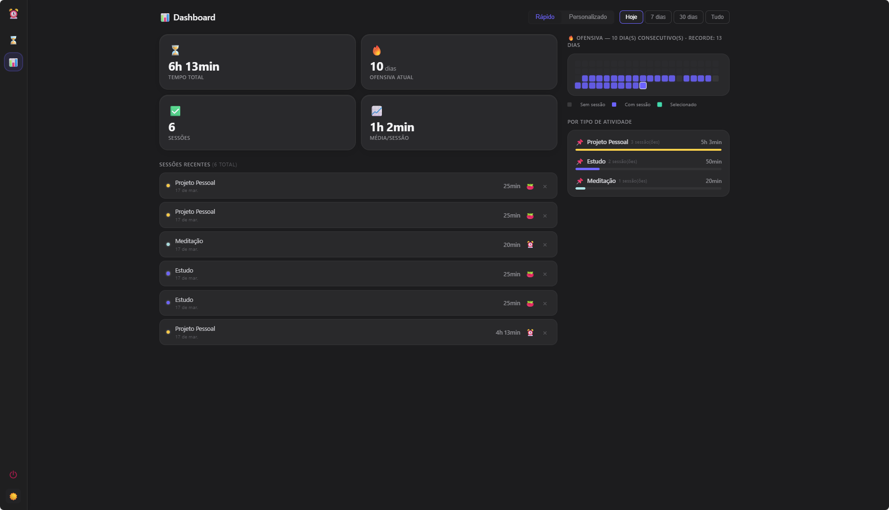
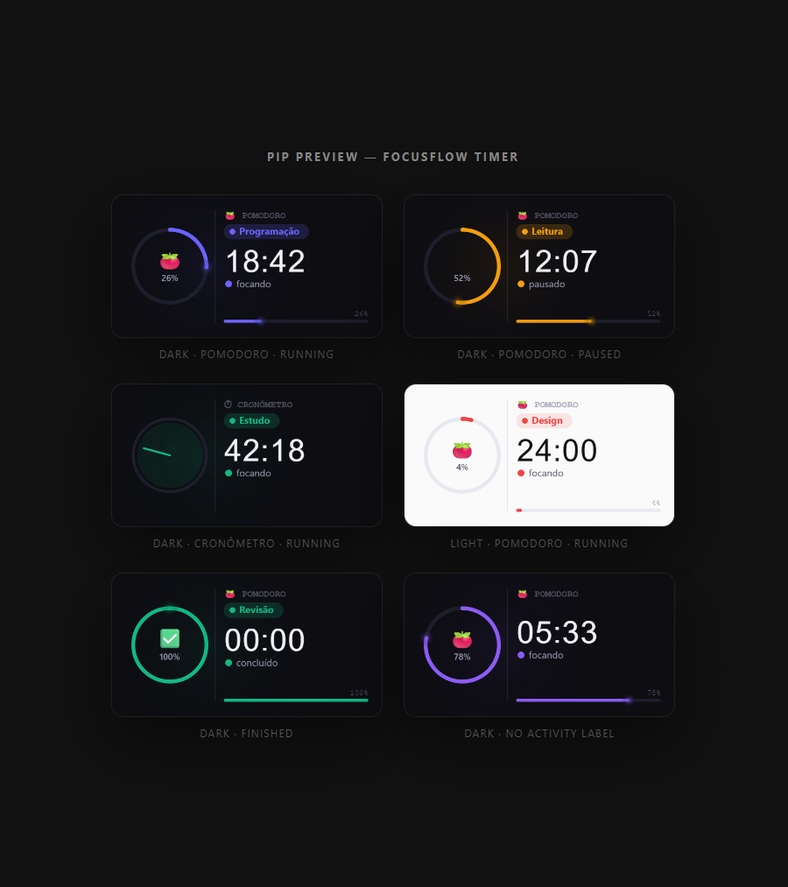

# FocusFlow

Personal productivity timer focused on consistency and clarity.

---

## Screenshots

| Login | Timer | Statistics | Picture-in-Picture |
|---|---|---|---|
|  |  |  |  |

---

## Features

**🍅 Timer**
- Pomodoro mode with configurable duration and user-saved presets (e.g., 25, 50, 90 min)
- Free stopwatch mode with no time limit
- Activity type per session (Study, Work, Exercise, Reading, Meditation, Personal Project, or custom)
- Animated progress bar, audio notification on completion, and pause/resume support
- Spotify integration to focus while listening to your favorite songs

**🖼️ Picture-in-Picture**
- Floating mini window (110×120px) with live time and progress
- Works across all apps and browser tabs, light/dark theme support

**📊 Dashboard**
- Streak tracking (current and personal record) and 70-day calendar heatmap
- Activity breakdown with color-coded bars, session count, and accumulated time
- Stats inline on the timer view: today, last 7d, last 30d, daily/weekly/monthly averages
- Filters by 7d / 30d / all time, with interactive calendar

**🎨 Theme & PWA**
- Light/dark mode with system detection and persistent preference
- Installable as a desktop or mobile app via PWA, with offline support

**🔐 Authentication**
- Email/password login — each account sees only its own data

---

## Tech Stack

| Layer | Technology |
|---|---|
| Framework | Angular 17 (Standalone Components) |
| State | Angular Signals |
| Auth & DB | Firebase Authentication + Cloud Firestore |
| Hosting | Firebase Hosting |
| PWA | @angular/pwa |
| Styling | SCSS (modular, per component) |
| PiP | Canvas API + Picture-in-Picture API |

---

## Run Locally

> This project's Firebase credentials are **not stored in the repository** to protect the author's account from unauthorized access and billing. To run locally, you'll need your own Firebase project (free tier is sufficient).

### 1. Create a Firebase project

1. Go to [console.firebase.google.com](https://console.firebase.google.com) and create a new project
2. Enable **Authentication** → Email/Password provider
3. Enable **Firestore Database** (test mode is fine)
4. Register a **Web App** and copy the config object

### 2. Set up environment

```sh
cp src/environments/environment.example.ts src/environments/environment.ts
```

Fill in `environment.ts` with your Firebase config:

```ts
export const environment = {
  production: false,
  firebase: {
    apiKey: "YOUR_API_KEY",
    authDomain: "YOUR_PROJECT.firebaseapp.com",
    projectId: "YOUR_PROJECT_ID",
    storageBucket: "YOUR_PROJECT.appspot.com",
    messagingSenderId: "YOUR_SENDER_ID",
    appId: "YOUR_APP_ID"
  }
};
```

> `environment.ts` is in `.gitignore` — your credentials will never be committed.

### 3. Install and run

```bash
npm install
ng serve
```

To test the PWA (requires a production build):

```bash
ng build
npx serve dist/focusflow/browser
```

---

## CI / Deploy (GitHub Actions)

The workflow generates `environment.ts` from GitHub Secrets at build time. To deploy your own fork, add these secrets under **Settings → Secrets and variables → Actions**:

| Secret | Where to find it |
|---|---|
| `FIREBASE_API_KEY` | Firebase console → Project settings → Your app |
| `FIREBASE_AUTH_DOMAIN` | same |
| `FIREBASE_PROJECT_ID` | same |
| `FIREBASE_STORAGE_BUCKET` | same |
| `FIREBASE_MESSAGING_SENDER_ID` | same |
| `FIREBASE_APP_ID` | same |
| `FIREBASE_SERVICE_ACCOUNT_*` | Firebase console → Project settings → Service accounts → Generate new private key (also created automatically via `firebase init hosting`) |

---

## Browser Compatibility

| Browser | Support |
|---|---|
| Chrome / Edge | Full, including PiP |
| Firefox | Full (PiP support varies) |
| Safari | Full on macOS / iOS |

---

## License

MIT — feel free to fork and customize.